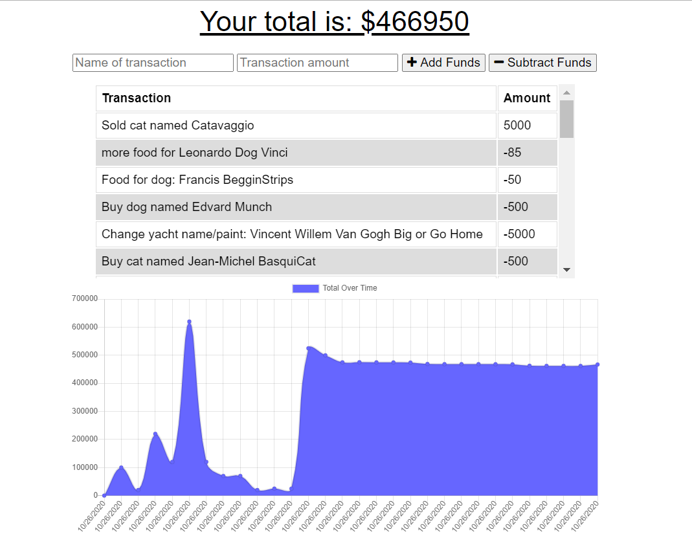

## Title

Spending Visualizer App

## Screenshot

## Description

This project is a budget-tracking app that will work regardless of whether or not the user's machine is connected to the internet. If the user is not connected to the internet, they will still be able to view their spending and income offline. Additionally, the user can add new transactions to the app in offline mode and these transactions will remain visible after reconnecting to the network. The Atlas database in conjunction with the Morgan logger npm package allows the user's data to persist over reloads, cache clearing, and sessions. They can use it any time, anywhere.

The user will first land on a screen with an input for the name of the transaction, an input for the cost of the transaction, a list of previous transactions, and a graph below the list, showing the changes in the total amount of money the user has. When they add a name and a value to a transaction, they will have the option to 'Add Funds' if they are expecting to receive money and 'Subtract Funds' if they are expecting to spend money. The changes to the graph will be made immediately upon clicking one of these buttons.

## Table of Contents :

[Title](#Title),
[Screenshot](#Screenshot)
[Description](#Description),
[Usage](#Usage),
[License](#License),
[Contributors](#Contributors),
[Questions](#Questions)

## Usage

My project can be used for educational or personal use only.

## License

This project is licensed under the MIT license.

## Contributors

Lauren Noeltner

## Questions

You can ask questions to Lauren on GitHub or LinkedIn at: https://www.github.com/LNoeltner1 or https://www.linkedin.com/in/lauren-noeltner-102b731a0/
